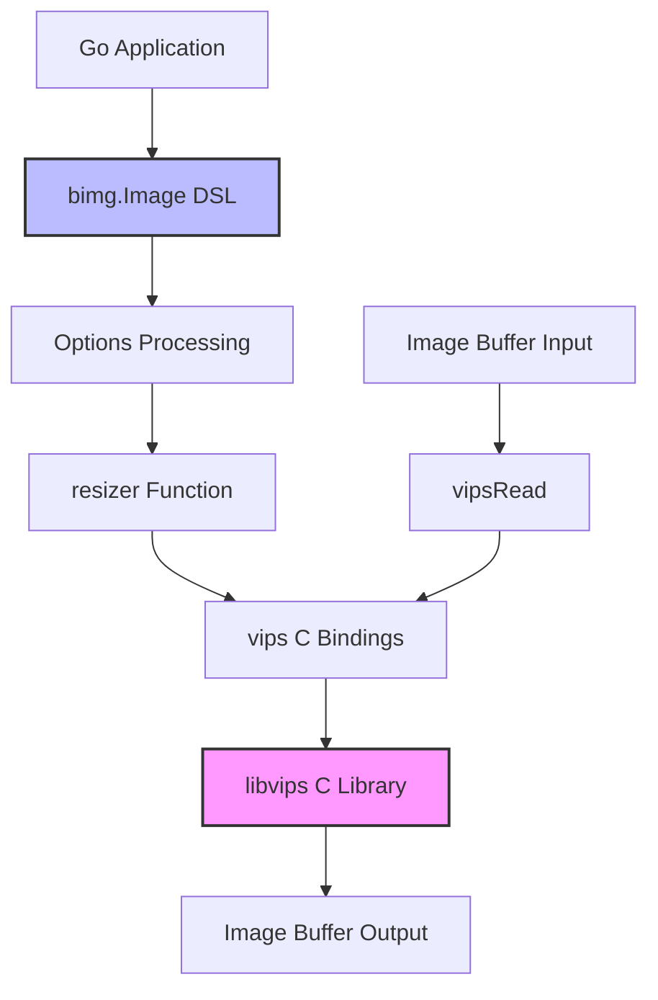

# bimg

> Fast, high-level Go image processing library powered by libvips via CGO bindings

## TL;DR

- **Purpose**: Provides a Go API for high-performance image transformations using libvips C library
- **Trigger**: Direct library import and method calls from Go applications
- **Key Services**: Native C library integration via CGO (libvips), no AWS services
- **Processing**: Resize, crop, rotate, watermark, format conversion, and effects on JPEG, PNG, WebP, TIFF, PDF, SVG, GIF, HEIF/AVIF, and JXL images
- **Where to Start**: `image.go` for the fluent API interface

## Architecture Overview

bimg is a Go library that wraps libvips through CGO to provide fast image processing. It accepts image byte buffers as input, applies transformations via libvips C functions, and returns processed image buffers. The library uses a fluent DSL interface for chaining operations and direct function calls for single operations.

## How It Works

1. **Image Loading**: Reads image byte buffers and detects format (JPEG, PNG, WebP, TIFF, PDF, SVG, GIF, HEIF, AVIF, JXL) via magic bytes
2. **Format Detection**: Uses `vipsImageType()` to identify image format from buffer headers
3. **Transformation Pipeline**: Applies operations in sequence - auto-rotate, shrink-on-load optimization, resize/crop, effects, watermarks
4. **EXIF Handling**: Automatically rotates images based on EXIF orientation metadata unless disabled
5. **Optimization**: Uses libvips shrink-on-load for JPEG/WebP to reduce memory usage on large images
6. **Color Space Management**: Converts images to target color space (RGB, sRGB, B&W, CMYK) and applies ICC profiles
7. **Output Encoding**: Saves transformed images to JPEG, PNG, WebP, TIFF, HEIF, AVIF, GIF, or JXL formats with quality/compression settings

## Configuration

bimg uses a comprehensive Options struct rather than environment variables.

| Option | Default | Description | Required |
|--------|---------|-------------|----------|
| Width | 0 | Target width in pixels | No |
| Height | 0 | Target height in pixels | No |
| Quality | 75 | JPEG/WebP quality (0-100) | No |
| Compression | 6 | PNG compression level (0-9) | No |
| Type | Auto | Output format (JPEG, PNG, WebP, etc.) | No |
| Crop | false | Enable crop mode | No |
| Enlarge | false | Allow enlarging smaller images | No |
| Embed | false | Embed image in canvas | No |
| Rotate | 0 | Rotation angle (0, 90, 180, 270) | No |
| NoAutoRotate | false | Disable EXIF auto-rotation | No |
| Flip | false | Flip vertically | No |
| Flop | false | Flip horizontally | No |
| Force | false | Force resize without aspect ratio | No |
| Gravity | GravityCentre | Crop gravity (Centre, North, South, East, West, Smart) | No |
| Interpolator | Bicubic | Resize interpolation algorithm | No |
| Kernel | CubicKernel | Resampling kernel for reduce operations | No |
| Interlace | false | Enable progressive/interlaced output | No |
| StripMetadata | false | Remove EXIF/metadata from output | No |
| NoProfile | false | Remove ICC color profile | No |
| Lossless | false | Enable lossless compression for WebP/AVIF | No |
| Background | Black | Background color for transparent images | No |
| GaussianBlur.Sigma | 0 | Gaussian blur strength | No |
| Sharpen.Radius | 0 | Sharpen radius | No |
| Gamma | 0 | Gamma correction value | No |
| Brightness | 0 | Brightness adjustment (-100 to 100) | No |
| Contrast | 0 | Contrast adjustment | No |
| Watermark | - | Text watermark configuration | No |
| WatermarkImage | - | Image watermark configuration | No |
| Trim | false | Auto-trim edges based on background color | No |
| Threshold | 0 | Threshold for trim operation | No |
| Speed | 0 | Encoder speed (0-8 for AVIF, 0-9 for PNG) | No |
| Palette | false | Use palette mode for PNG | No |
| InputICC | "" | Path to input ICC profile | No |
| OutputICC | "" | Path to output ICC profile | No |

## Component Breakdown

### Image Struct

Provides a fluent DSL interface for chaining image operations. Wraps an image buffer and exposes methods like `Resize()`, `Crop()`, `Rotate()`, `Watermark()` that return the modified buffer and update the internal state.

### resizer Function

Core transformation engine in `resizer.go` that orchestrates the entire image processing pipeline. Loads images, applies defaults, handles EXIF rotation, calculates optimal shrink factors, applies transformations (resize, crop, extract), effects (blur, sharpen, gamma), watermarks, and saves output. Uses libvips shrink-on-load for JPEG/WebP when shrink >= 2 to reduce memory usage.

### vips Bindings

CGO wrapper functions in `vips.go` that interface with libvips C library. Includes thread-safe initialization, memory management with configurable cache limits (default 100MB, 500 operations), and low-level operations like `vipsRotate`, `vipsZoom`, `vipsExtract`, `vipsShrink`, `vipsWatermark`, `vipsGaussianBlur`, `vipsSave`.

### Type Detection

Image format identification system in `type.go` using magic byte sequences. Supports lazy discovery of libvips-supported formats at runtime with thread-safe caching.

### Metadata Extraction

EXIF and image metadata reading in `metadata.go`. Extracts comprehensive EXIF data including camera settings, GPS coordinates, timestamps, and image properties (size, channels, alpha, color space).

### Options Processing

Transformation configuration in `options.go`. Defines all supported operations including geometric transforms, color adjustments, compression settings, and output formats.

## Troubleshooting

### libvips Version Issues

**Problem**: Unsupported image formats or missing features

**Solution**: Upgrade to libvips 8.3+ for GIF/PDF/SVG, 8.6+ for trim, 8.9+ for AVIF. Check support with `VipsIsTypeSupported()`.

### Memory Leaks

**Problem**: Growing memory usage over time

**Solution**: Ensure `vips_thread_shutdown()` is called (automatic via defer). Adjust cache limits with `VipsCacheSetMaxMem()` and `VipsCacheSetMax()`. Call `VipsCacheDropAll()` to force cache cleanup.

### CGO Build Errors

**Problem**: Cannot find vips/vips.h or linking errors

**Solution**: Install libvips development headers and ensure pkg-config can find vips. Set `PKG_CONFIG_PATH` if needed. On macOS: `brew install vips`. On Ubuntu/Debian: `apt-get install libvips-dev`.

### Panic on Initialization

**Problem**: "unsupported libvips version!" or "unable to start vips!" panic

**Solution**: Requires libvips 7.40+. Check installation with `pkg-config --modversion vips`. Reinstall libvips if version is too old.

### Smart Crop Not Working

**Problem**: Smart crop doesn't focus on interesting areas

**Solution**: Requires libvips 8.5+. Ensure `Gravity: GravitySmart` is set. Smart crop analyzes image entropy to find regions of interest.

### Maximum Image Size Exceeded

**Problem**: "Maximum image size exceeded" error

**Solution**: Default max dimension is 16383 pixels. Change with `SetMaxsize(newSize)`. Ensure sufficient memory for large images.

## Related Repositories

This is a fork of the upstream repository:
- **h2non/bimg**: https://github.com/h2non/bimg - Original upstream project
- **libvips/libvips**: https://github.com/libvips/libvips - Underlying C library
- **h2non/imaginary**: https://github.com/h2non/imaginary - HTTP microservice built on bimg

For HTTP-based image processing, consider using imaginary which provides a REST API on top of bimg.

